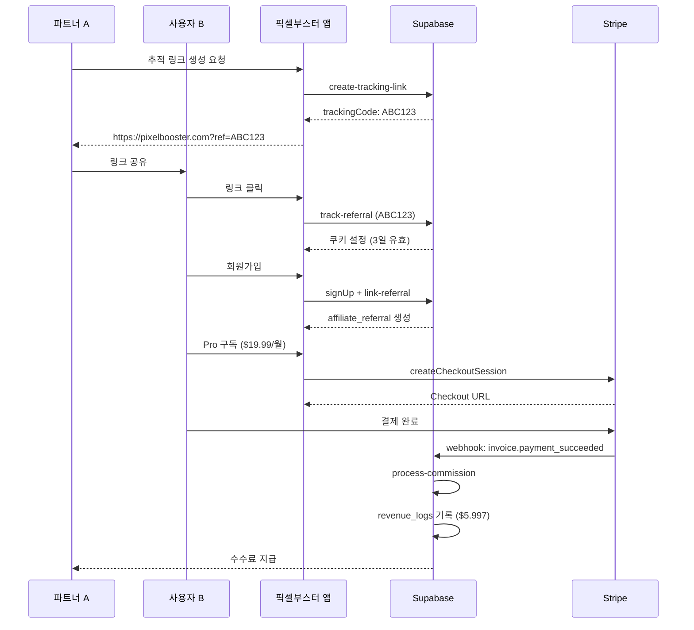

# 어필리에이트 시스템

더카당 픽셀부스터의 어필리에이트 시스템 설계 및 구현 가이드입니다.

---

## 📌 개요

어필리에이트 시스템은 파트너(어필리에이터)가 사용자를 추천하고, 추천받은 사용자가 구독을 유지하는 동안 지속적으로 수수료를 받는 구조입니다.

### 핵심 목표
- **초기 사용자 확보**: 파트너를 통한 바이럴 마케팅
- **마케팅 채널 다각화**: 다양한 유입 경로 확보
- **Win-Win 모델**: 파트너와 플랫폼 모두 수익

---

## 🏗️ 시스템 아키텍처

### 1. 쿠키 추적 흐름

```
사용자 → 어필리에이트 링크 클릭
        ↓
쿠키 저장 (3일 유효)
        ↓
회원가입 및 구독
        ↓
추천 기록 생성 (affiliate_referrals)
        ↓
구독 갱신 시마다 수수료 계산
```

### 2. 데이터베이스 구조

#### affiliates 테이블
```sql
- id: UUID (PK)
- user_id: UUID (FK → auth.users)
- tracking_code: TEXT (Unique, 고유 추적 코드)
- commission_rate: DECIMAL(5,2) (수수료율 0-100%)
- created_at: TIMESTAMP
```

#### affiliate_referrals 테이블
```sql
- id: UUID (PK)
- affiliate_id: UUID (FK → affiliates)
- referred_user_id: UUID (FK → auth.users)
- subscription_id: UUID (FK → subscriptions)
- created_at: TIMESTAMP
```

#### revenue_logs 테이블
```sql
- id: UUID (PK)
- user_id: UUID (FK → auth.users, 구독자)
- affiliate_id: UUID (FK → affiliates)
- amount: DECIMAL(10,2) (총 결제 금액)
- commission_amount: DECIMAL(10,2) (파트너 수수료)
- created_at: TIMESTAMP
```

---

## 🔧 주요 기능

### 1. 추적 링크 생성

**엔드포인트**: `POST /functions/v1/create-tracking-link`

**요청**:
```json
{
  "userId": "uuid"
}
```

**응답**:
```json
{
  "success": true,
  "data": {
    "trackingCode": "ABC123",
    "trackingUrl": "https://pixelbooster.com?ref=ABC123",
    "commissionRate": 30.00
  }
}
```

**로직**:
1. 사용자가 이미 어필리에이트인지 확인
2. 신규인 경우 8자 랜덤 코드 생성
3. `affiliates` 테이블에 삽입
4. 기본 수수료율 30% 설정

---

### 2. 쿠키 추적

**엔드포인트**: `POST /functions/v1/track-referral`

**요청**:
```json
{
  "trackingCode": "ABC123",
  "userAgent": "Mozilla/5.0...",
  "ipAddress": "123.456.789.0"
}
```

**응답**:
```json
{
  "success": true,
  "message": "Referral tracked successfully",
  "expiresAt": "2025-11-13T12:00:00Z"
}
```

**로직**:
1. tracking_code로 affiliate_id 조회
2. 쿠키 생성 (3일 유효)
3. user_events 테이블에 방문 기록

**클라이언트 쿠키 저장**:
```javascript
// Electron Main Process
const { session } = require('electron');

async function setAffiliateCookie(trackingCode) {
  const expirationDate = Date.now() + (3 * 24 * 60 * 60 * 1000); // 3일

  await session.defaultSession.cookies.set({
    url: 'https://pixelbooster.com',
    name: 'ref_code',
    value: trackingCode,
    expirationDate: expirationDate / 1000,
    httpOnly: true,
    secure: true
  });
}
```

---

### 3. 회원가입 시 추천 연결

**엔드포인트**: `POST /functions/v1/link-referral`

**요청**:
```json
{
  "userId": "uuid",
  "trackingCode": "ABC123"
}
```

**응답**:
```json
{
  "success": true,
  "message": "Referral linked successfully"
}
```

**로직**:
1. 쿠키에서 tracking_code 확인 (3일 이내)
2. tracking_code로 affiliate_id 조회
3. 사용자의 구독 정보 조회 (subscription_id)
4. `affiliate_referrals` 테이블에 삽입

**타이밍**:
- **회원가입 완료 직후** 자동 실행
- AuthManager.signUp() 성공 시 호출

---

### 4. 수수료 계산 (구독 갱신 시)

**엔드포인트**: `POST /functions/v1/process-commission`

**요청** (Stripe Webhook):
```json
{
  "event": "invoice.payment_succeeded",
  "subscriptionId": "sub_123",
  "amount": 9.99,
  "currency": "USD"
}
```

**응답**:
```json
{
  "success": true,
  "data": {
    "affiliateId": "uuid",
    "commissionAmount": 2.997,
    "commissionRate": 30.00
  }
}
```

**로직**:
1. subscription_id로 affiliate_referrals 조회
2. affiliate_id로 commission_rate 조회
3. 수수료 계산: `amount * (commission_rate / 100)`
4. `revenue_logs` 테이블에 삽입

**트리거**:
- Stripe Webhook: `invoice.payment_succeeded`
- 매월 구독 갱신 시 자동 실행

---

## 🎨 UI 컴포넌트

### 1. AffiliatePanel (어필리에이트 대시보드)

**위치**: `client/src/components/AffiliatePanel.jsx`

**기능**:
- 추적 링크 생성 버튼
- 현재 링크 복사 버튼
- 통계 카드 4개:
  - 총 추천 수
  - 활성 구독자 수
  - 이번 달 수익
  - 총 누적 수익

**디자인**:
```
┌────────────────────────────────────────────┐
│  🔗 어필리에이트 대시보드                   │
├────────────────────────────────────────────┤
│  추적 링크: https://pixelbooster.com?ref=ABC123 │
│  [복사] [공유]                             │
├────────────────────────────────────────────┤
│  📊 통계                                    │
│  ┌──────┐ ┌──────┐ ┌──────┐ ┌──────┐      │
│  │ 총추천│ │활성구독│ │이번달│ │총수익│      │
│  │  15  │ │  12  │ │ $35 │ │ $420│       │
│  └──────┘ └──────┘ └──────┘ └──────┘      │
├────────────────────────────────────────────┤
│  📋 추천 내역                               │
│  [테이블: 날짜, 사용자, 상태, 수익]          │
└────────────────────────────────────────────┘
```

---

### 2. AffiliateReferralList (추천 내역 목록)

**위치**: `client/src/components/AffiliateReferralList.jsx`

**기능**:
- 추천한 사용자 목록
- 각 사용자의 구독 상태
- 지급된 수수료 내역

**테이블 컬럼**:
| 날짜 | 사용자 이메일 | 구독 상태 | 구독 등급 | 이번 달 수익 | 총 수익 |
|------|--------------|----------|----------|-------------|--------|
| 2025-11-10 | user@example.com | 활성 | Pro | $5.99 | $59.90 |

---

## 🔐 보안 고려사항

### 1. 쿠키 위변조 방지
- **HttpOnly**: JavaScript에서 접근 불가
- **Secure**: HTTPS에서만 전송
- **SameSite=Strict**: CSRF 공격 방지

### 2. 중복 추천 방지
- **Unique Constraint**: `affiliate_referrals.subscription_id` (한 구독당 하나의 추천만)
- **쿠키 만료**: 3일 이후 추천 연결 불가

### 3. 수수료 조작 방지
- **RLS 정책**: `service_role`만 `revenue_logs` 삽입 가능
- **Immutable Logs**: 수수료 기록은 수정 불가 (감사 추적)

---

## 📊 관리자 대시보드 기능

### 1. 파트너 관리
- 전체 파트너 목록
- 파트너별 수수료율 조정
- 파트너 활성화/비활성화

### 2. 수익 통계
- 일별/월별 총 수수료 지급액
- 파트너별 수익 순위
- 추천 전환율 분석

### 3. 어뷰징 감지
- 동일 IP에서 다수 회원가입 감지
- 구독 후 즉시 취소 패턴 감지
- 의심스러운 파트너 플래그

---

## 🧪 테스트 시나리오

### 1. 정상 추천 흐름
```
1. 파트너 A가 추적 링크 생성: https://pixelbooster.com?ref=ABC123
2. 사용자 B가 링크 클릭 → 쿠키 저장
3. 사용자 B가 2일 후 회원가입 및 Pro 구독 ($19.99/월)
4. affiliate_referrals에 기록 생성
5. 첫 결제 성공 → revenue_logs에 수수료 기록 ($19.99 * 0.3 = $5.997)
6. 매월 갱신 시마다 수수료 지급
```

### 2. 쿠키 만료 케이스
```
1. 파트너 A가 추적 링크 생성
2. 사용자 B가 링크 클릭 → 쿠키 저장
3. 사용자 B가 4일 후 회원가입 (쿠키 만료)
4. 추천 연결 실패 (3일 초과)
```

### 3. 중복 추천 방지
```
1. 파트너 A가 링크 생성: ref=ABC123
2. 사용자 B가 링크 클릭 → 쿠키 저장
3. 사용자 B가 다른 파트너 C의 링크 클릭: ref=XYZ789
4. 회원가입 시 **최신 쿠키 우선** (파트너 C로 연결)
```

---

## 🔄 워크플로우 다이어그램



---

## 📈 구현 우선순위

### Phase 1: 기본 추적 (현재 단계)
- [x] DB 스키마 완료
- [ ] Edge Function: track-referral
- [ ] Edge Function: link-referral
- [ ] 클라이언트: 쿠키 저장 로직
- [ ] 회원가입 시 자동 연결

### Phase 2: 수수료 계산
- [ ] Edge Function: process-commission
- [ ] Stripe Webhook 연동
- [ ] revenue_logs 자동 기록

### Phase 3: UI 구현
- [ ] AffiliatePanel 컴포넌트
- [ ] AffiliateReferralList 컴포넌트
- [ ] 통계 대시보드

### Phase 4: 관리자 기능
- [ ] 파트너 관리 페이지
- [ ] 수수료율 조정 UI
- [ ] 어뷰징 감지 시스템

---

## 🛠️ 구현 가이드

### Edge Function: track-referral

**파일**: `supabase/functions/track-referral/index.ts`

```typescript
import { serve } from 'https://deno.land/std@0.168.0/http/server.ts';
import { createClient } from 'https://esm.sh/@supabase/supabase-js@2';

serve(async (req) => {
  try {
    const { trackingCode, userAgent, ipAddress } = await req.json();

    // Supabase 클라이언트 초기화
    const supabase = createClient(
      Deno.env.get('SUPABASE_URL') ?? '',
      Deno.env.get('SUPABASE_SERVICE_ROLE_KEY') ?? ''
    );

    // 1. tracking_code로 affiliate 조회
    const { data: affiliate, error: affiliateError } = await supabase
      .from('affiliates')
      .select('id')
      .eq('tracking_code', trackingCode)
      .single();

    if (affiliateError || !affiliate) {
      return new Response(
        JSON.stringify({ success: false, error: 'Invalid tracking code' }),
        { status: 404, headers: { 'Content-Type': 'application/json' } }
      );
    }

    // 2. user_events에 방문 기록
    const expiresAt = new Date(Date.now() + 3 * 24 * 60 * 60 * 1000); // 3일

    await supabase
      .from('user_events')
      .insert({
        user_id: null,
        event_type: 'affiliate_click',
        event_data: {
          affiliate_id: affiliate.id,
          tracking_code: trackingCode,
          expires_at: expiresAt.toISOString()
        },
        ip_address: ipAddress,
        user_agent: userAgent
      });

    return new Response(
      JSON.stringify({
        success: true,
        message: 'Referral tracked successfully',
        expiresAt: expiresAt.toISOString()
      }),
      { status: 200, headers: { 'Content-Type': 'application/json' } }
    );
  } catch (error) {
    return new Response(
      JSON.stringify({ success: false, error: error.message }),
      { status: 500, headers: { 'Content-Type': 'application/json' } }
    );
  }
});
```

---

### 클라이언트: AffiliateManager

**파일**: `client/src/services/affiliate-manager.ts`

```typescript
import { app, session } from 'electron';
import { createClient } from '@supabase/supabase-js';

export class AffiliateManager {
  private supabase;

  constructor() {
    this.supabase = createClient(
      process.env.SUPABASE_URL!,
      process.env.SUPABASE_ANON_KEY!
    );
  }

  /**
   * 어필리에이트 링크에서 쿠키 저장
   */
  async trackReferral(trackingCode: string): Promise<void> {
    try {
      // 1. 서버에 추적 요청
      const { data, error } = await this.supabase.functions.invoke('track-referral', {
        body: {
          trackingCode,
          userAgent: 'PixelBooster/1.0.0',
          ipAddress: await this.getLocalIP()
        }
      });

      if (error) throw error;

      // 2. 로컬 쿠키 저장
      const expirationDate = new Date(data.expiresAt).getTime() / 1000;

      await session.defaultSession.cookies.set({
        url: 'https://pixelbooster.com',
        name: 'ref_code',
        value: trackingCode,
        expirationDate,
        httpOnly: true,
        secure: true,
        sameSite: 'strict'
      });

      console.log('[AffiliateManager] Referral tracked:', trackingCode);
    } catch (error) {
      console.error('[AffiliateManager] trackReferral error:', error);
      throw error;
    }
  }

  /**
   * 회원가입 시 추천 연결
   */
  async linkReferralToUser(userId: string): Promise<void> {
    try {
      // 1. 쿠키에서 tracking_code 조회
      const cookies = await session.defaultSession.cookies.get({
        url: 'https://pixelbooster.com',
        name: 'ref_code'
      });

      if (cookies.length === 0) {
        console.log('[AffiliateManager] No referral cookie found');
        return;
      }

      const trackingCode = cookies[0].value;

      // 2. 서버에 연결 요청
      const { error } = await this.supabase.functions.invoke('link-referral', {
        body: { userId, trackingCode }
      });

      if (error) throw error;

      // 3. 쿠키 삭제 (일회성)
      await session.defaultSession.cookies.remove(
        'https://pixelbooster.com',
        'ref_code'
      );

      console.log('[AffiliateManager] Referral linked successfully');
    } catch (error) {
      console.error('[AffiliateManager] linkReferralToUser error:', error);
    }
  }

  /**
   * 로컬 IP 주소 조회
   */
  private async getLocalIP(): Promise<string> {
    // 구현 생략 (네트워크 인터페이스에서 IP 추출)
    return '127.0.0.1';
  }
}
```

---

## 📚 참고 자료

- [Stripe Affiliate Tracking](https://stripe.com/docs/billing/subscriptions/webhooks)
- [Electron Cookies API](https://www.electronjs.org/docs/api/cookies)
- [Supabase Edge Functions](https://supabase.com/docs/guides/functions)

---

**마지막 업데이트**: 2025-11-10
**작성자**: Claude Code
**상태**: 구현 준비 완료 ✅
